# Jobsheet 6 - VR Pertemuan 6

## Tugas – Bagian 1
#### Tambahkan panorama pada halaman menu

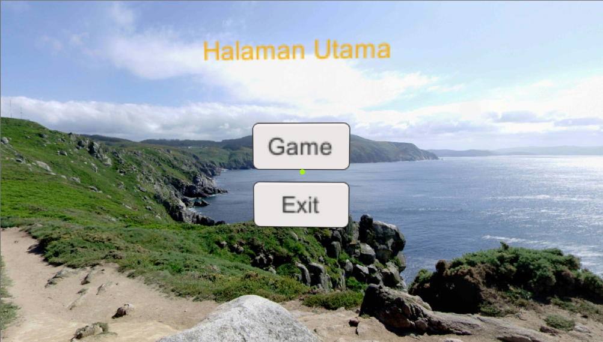

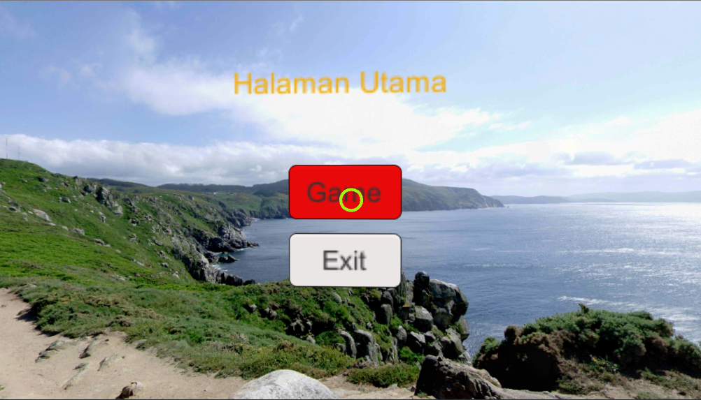

## Tugas – Bagian 2
#### Ubah hasil klik tombol Game menjadi pindah ke halaman Menu Game yang berisi beberapa tombol dimana setiap tombol mengarahkan ke Game yang dibuat pada minggu ke-3, ke-4, dan ke-5.

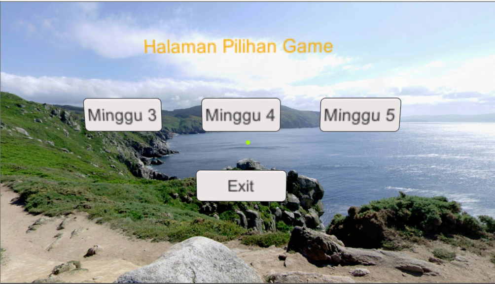

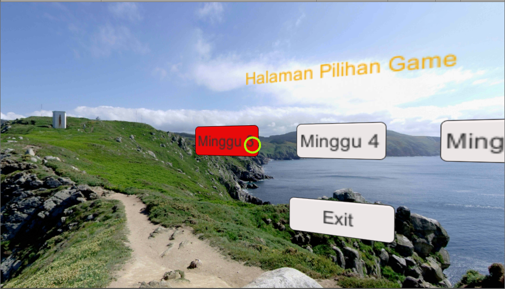

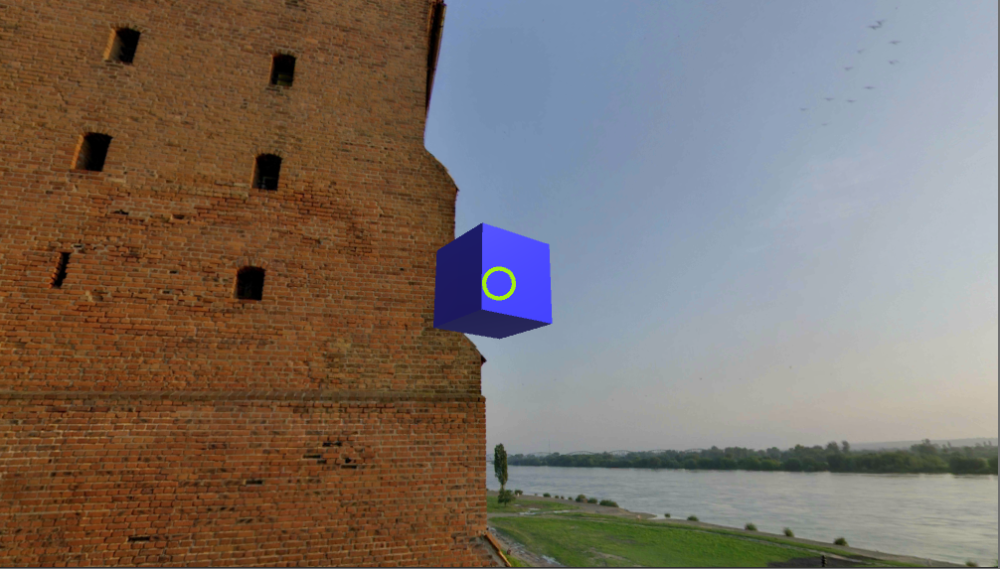

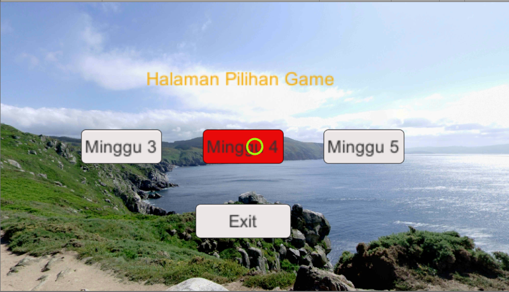

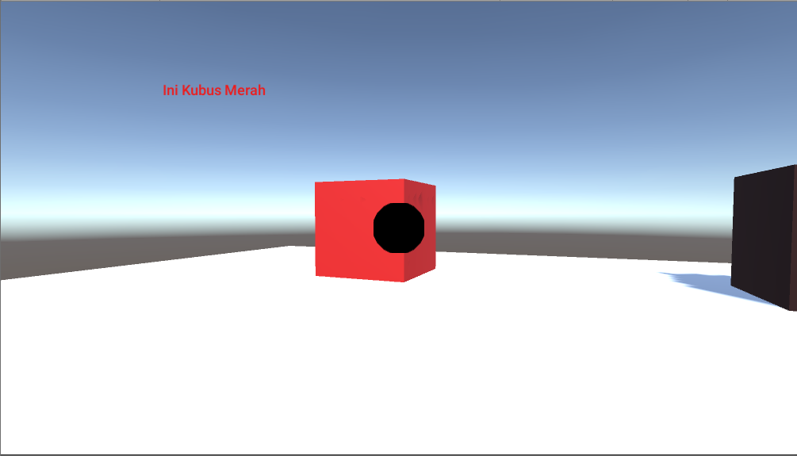

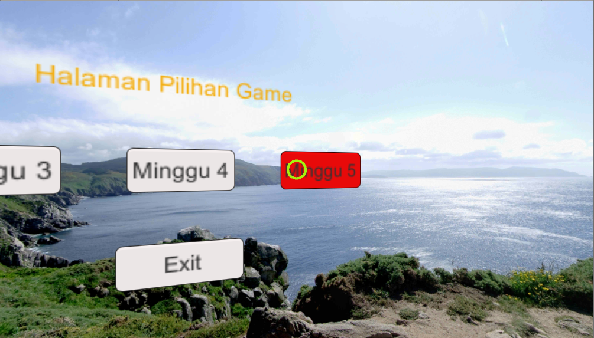

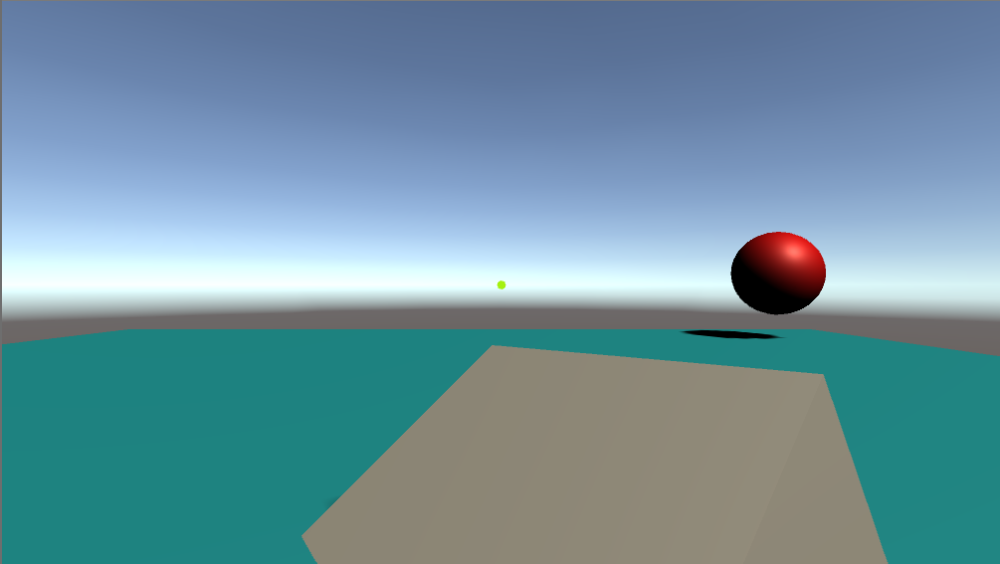

## Tugas – Bagian 3
#### Untuk setiap tombol yang di klik (kecuali tombol keluar), munculkan tulisan di layar Game (**Nama Mahasiswa** memasuki Game Minggu Ke - **nomor minggu yang dimaksud**), 
**Contoh:** `Nugraha memasuki Game Minggu Ke- 4`

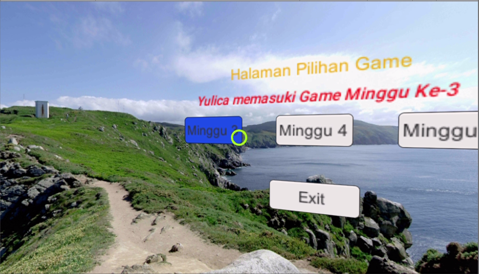

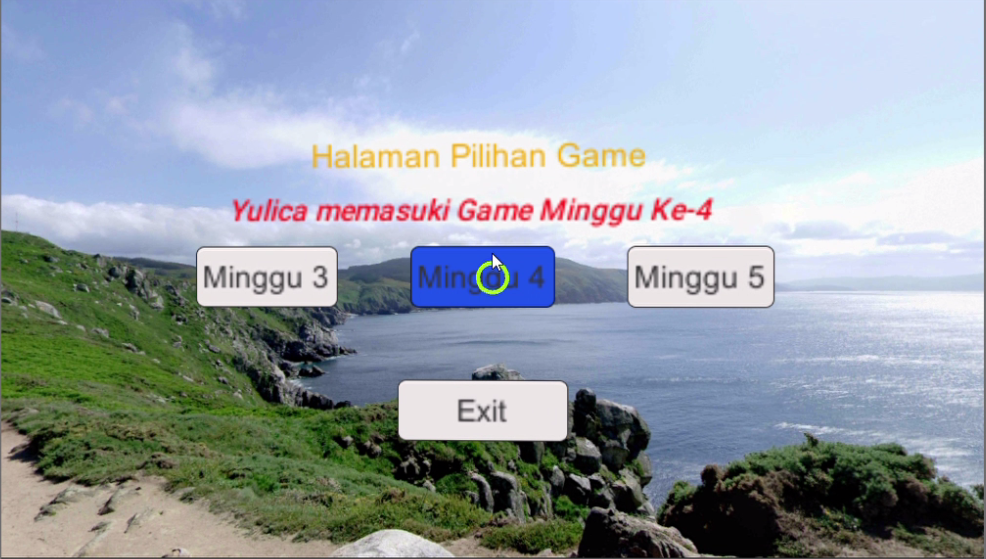

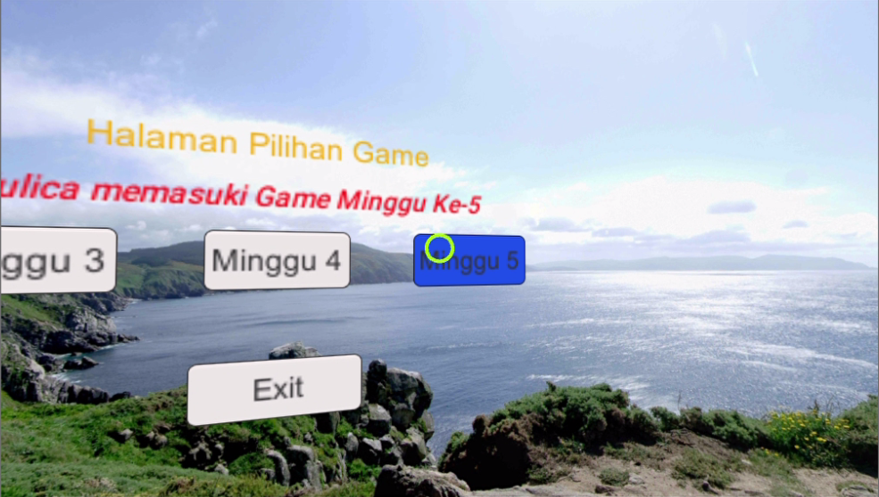